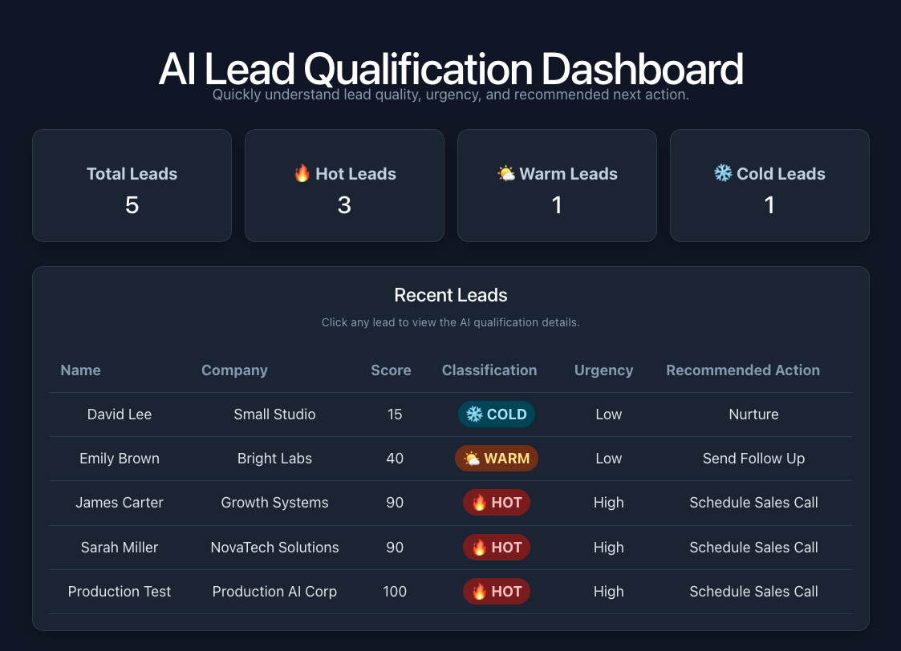

# AI Lead Qualification Platform

An end-to-end AI-powered sales workflow that automatically scores, classifies, summarizes, and routes inbound leads using deterministic business rules, OpenAI, and LangGraph.

### Live Project
- **Frontend:** https://ai-lead-qualification-gamma.vercel.app
- **API Docs:** https://ai-lead-qualification-lz2o.onrender.com/docs
- **GitHub:** https://github.com/Waseemhazarisyed/ai-lead-qualification

---

## Dashboard Preview

  

---

## Project Highlights

- 98.8% final untouched evaluation score
- 100% lead classification accuracy
- 100% workflow routing accuracy
- Human-in-the-loop approval for HOT leads
- LangGraph workflow orchestration
- OpenAI-powered intent analysis and summarization
- Deterministic lead scoring and business rules
- PostgreSQL persistence
- React management dashboard
- Deployed on Vercel + Render

---

## Business Problem

Sales teams receive inbound leads with different budgets, company sizes, urgency levels, and buying intent.

Manually reviewing every inquiry is slow and inconsistent.

This platform automatically evaluates each lead and helps sales teams answer:

> **Who should we contact first, and why?**

---

## Solution

Each incoming lead moves through an automated AI workflow:

Customer Lead  
↓  
FastAPI Backend  
↓  
Deterministic Business Rules + OpenAI Analysis  
↓  
LangGraph Workflow  
↓  
HOT / WARM / COLD  
↓  
Human Review / Follow-Up / Nurture  
↓  
PostgreSQL  
↓  
React Dashboard

---

## Final Evaluation Results

| Metric | Result |
|---|---:|
| Classification | 100% |
| Routing | 100% |
| Urgency | 95% |
| Recommended Action | 100% |
| **Overall** | **98.8%** |

The final score was measured using a separate unseen evaluation dataset after the scoring logic was frozen.
